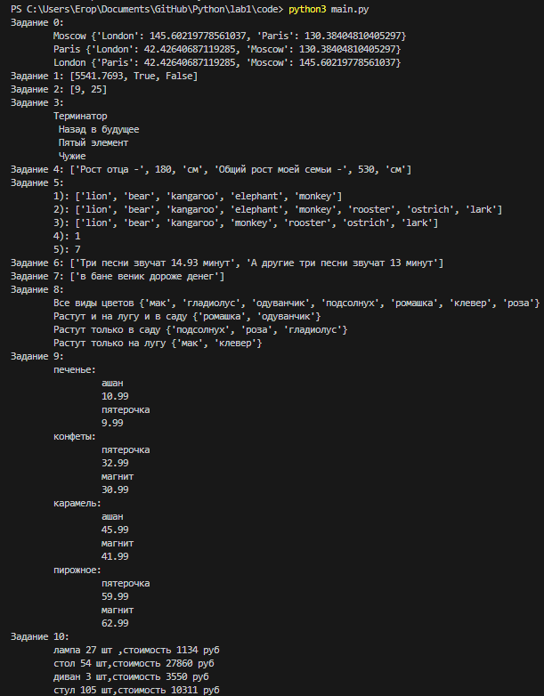

# Лабораторная работа №1
## Условия задач
0)Составить словарь расстояний между городами.\
1)Вычислить площадь круга и узнать находятся ли точки внутри круга.\
2)Расставить знаки операций между числами "1 2 3 4 5" так, что бы получилось число "25", написать формулу для 1 2 3 4 5.\
3)Выведите на консоль с помощью индексации строки, последовательно:первый фильм, последний, второй, второй с конца.\
4)Составить список списков роста своей семьи и вывести рост отца, общий рост семьи.\
5)Посадить медведя между лвом и кенгуру, добавить птиц из списка birds, убрать слона, вывести в какой клетке сидит лев, в какой жаворонок.\
6)Вывести общее время звучания трех песен: 'Halo', 'Enjoy the Silence' и 'Clean', вывести общее время звучания трех песен: 'Sweetest Perfection', 'Policy of Truth' и 'Blue Dress'.\
7)Вывести расшифрованое сообщение.\
8)Вывести все виды цветов. Те которые растут и там и там. Те которые растут в саду но не растут на лугу. Те которые растут на лугу но не растут в саду.\
9)Создать словарь цен на продукты указывая только по два магазина с минимальными ценами.\
10)Вывести стоимость каждого вида товара на складе.
## Описание проделанной работы
Написаны функции для решения каждой задачи. А также создат верхнеуровневый модуль который использует логику из модулей заданий.
## Результат
\
Шпаргалка по работе с командами git:
---
git push - Команда Git push позволяет отправлять локальную ветку на удаленный репозиторий.\
git add - Команда git add добавляет содержимое рабочего каталога в индекс (staging area) для последующего коммита.\
git status - Команда git status показывает состояния файлов в рабочем каталоге и индексе: какие файлы изменены, но не добавлены в индекс; какие ожидают коммита в индексе.\
git commit - Команда git commit берёт все данные, добавленные в индекс с помощью git add, и сохраняет их слепок во внутренней базе данных, а затем сдвигает указатель текущей ветки на этот слепок. \
git rm - Команда git rm используется в Git для удаления файлов из индекса и рабочей копии. Она похожа на git add с тем лишь исключением, что она удаляет, а не добавляет файлы для следующего коммита.

Список использованных источников:
---
[1.Справка по markdown](https://doka.guide/tools/markdown)\
[2.Официальный Python tutorial](https://docs.python.org/3/tutorial)\
[3.Git - Основные команды](https://git-scm.com/book/ru/v2)
