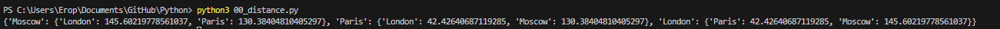
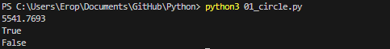
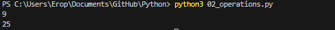
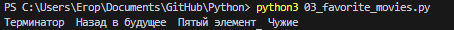
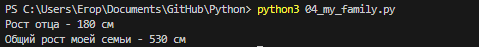
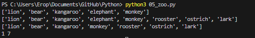
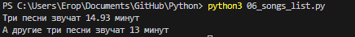
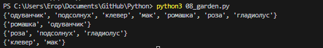
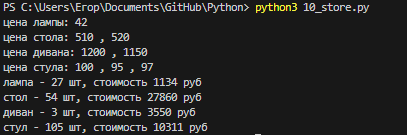

# Лабораторная работа №1
Написал решения для каждого задания. А также написал верхнеуровневый модуль, который использует логику из модулей-заданий.
## Задание 0
Составить словарь словарей расстояний между городами\
Ответ:

## Задание 1
1.Найти площадь круга и вывести.\
2.Если точка point лежит внутри круга ,то вывести на консоль True, Или False, если точка лежит вовне круга.\
3.Если точка point_2 лежит внутри круга , то вывести на консоль True,Или False, если точка лежит вовне круга.\
Ответ:\

## Задание 2
Расставьте знаки операций "плюс", "минус", "умножение" и скобкимежду числами "1 2 3 4 5" так, что бы получилось число "25".\
Ответ:\

## Задание 3
Выведите на консоль с помощью индексации строки, последовательно:первый фильм,последний,второй,второй с конца.\
Ответ:\

## Задание 4
Создать список роста членов моей семьи и вывести рост отца, общий рост семьи.\
Список списков приблизителного роста членов вашей семьи.\
Выведите на консоль рост отца.\
Выведите на консоль общий рост вашей семьи как сумму ростов всех членов.\
Ответ:\

## Задание 5
1.Посадить медведя (bear) между львом и кенгуру и вывести список на консоль.\
2.Добавить птиц из списка birds в последние клетки зоопарка.\
3.Убрать слона вывести список на консоль.\
4.Вывести на консоль в какой клетке сидит лев (lion) и жаворонок (lark).\
Ответ:\

## Задание 6
1.Распечатать общее время звучания трех песен: 'Halo', 'Enjoy the Silence' и 'Clean'.\
2.Распечатать общее время звучания трех песен: 'Sweetest Perfection', 'Policy of Truth' и 'Blue Dress'.\
Ответ:\

## Задание 7
Есть зашифрованное сообщение. Нужно его расшифровать и вывести на консоль в удобочитаемом виде.\
Ответ:\

## Задание 8
Создать множество цветов, произрастающих в саду и на лугу.\
1.Выведите на консоль все виды цветов.\
2.Выведите на консоль те, которые растут и там и там.\
3.Выведите на консоль те, которые растут в саду, но не растут на лугу.\
4.Выведите на консоль те, которые растут на лугу, но не растут в саду.\
Ответ:\

## Задание 9
Создать словарь цен на продукты\
Ответ:\
('ашан', 'пятёрочка')
## Задание 10
Вывести стоимость каждого вида товара на складе: один раз распечать сколько всего столов и их общая стоимость, один раз распечать сколько всего стульев и их общая стоимость, и т.д. на складе.\
Ответ:\
\

Шпаргалка по работе с командами git:
---
git push - Команда Git push позволяет отправлять локальную ветку на удаленный репозиторий.\
git add - Команда git add добавляет содержимое рабочего каталога в индекс (staging area) для последующего коммита.\
git status - Команда git status показывает состояния файлов в рабочем каталоге и индексе: какие файлы изменены, но не добавлены в индекс; какие ожидают коммита в индексе.\
git commit - Команда git commit берёт все данные, добавленные в индекс с помощью git add, и сохраняет их слепок во внутренней базе данных, а затем сдвигает указатель текущей ветки на этот слепок. \
git rm - Команда git rm используется в Git для удаления файлов из индекса и рабочей копии. Она похожа на git add с тем лишь исключением, что она удаляет, а не добавляет файлы для следующего коммита. \ 

Список использованных источников:
---
[1.Справка по markdown](https://doka.guide/tools/markdown)\
[2.Официальный Python tutorial](https://docs.python.org/3/tutorial)\
[3.Git - Основные команды](https://git-scm.com/book/ru/v2)
