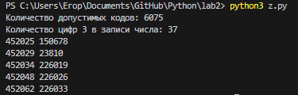

# Лабораторная работа №2
## Условия задач
1)Настя составляет 6-буквенные коды из букв Н, А, С, Т, Я. Каждая допустимая гласная буква может входить в код не более одного раза. Сколько кодов может составить Настя?\
2)Значение арифметического выражения 16^18*4^10-46-16 записали в системе счисления с основанием 4. Сколько цифр 3 содержится в этой записи\
3)Пусть M  — сумма минимального и максимального натуральных делителей целого числа, не считая единицы и самого числа. Если таких делителей у числа нет, то считаем значение M равным нулю. Найдите целые числа, большие 452 021, в порядке возрастания, такие, для которых значение M при делении на 7 даёт в остатке 3. Вывести первые 5 найденных чисел и соответствующие им значения M.
## Описание проделланой работы
### Задание 1
Написана функция, которая генерирует все возможные 6-буквенные комбинации из заданных букв. Выводит количество комбинаций.
### Задание 2
Написана функция, которая считает выражение, переводит его значение в систему счисления с основанием 4 и считает количество 3 в результате. Выводит количество 3.
### Задание 3 
Написана функция, которая ищет максимальный и минимальный делитель числа, находит его сумму и проверяет делится ли сумма на 7 с остатком 3.Выволит первые пять чимсле с суммой его делителей.

### Дополнительное задание
Добавлены доктесты для каждого задания для проверки ответов.
## Результат

