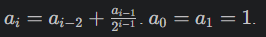

# Лабораторная работа №3
## Условия задач
Напишите две функции для решения задач своего варианта - с использованием рекурсии и без.\
1)Функция для преобразования вложенных списков в строку.\
2)Функция для расчёта:

