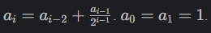
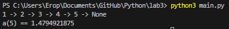

# Лабораторная работа №3
## Условия задач
Напишите две функции для решения задач своего варианта - с использованием рекурсии и без.\
1)Функция для преобразования вложенных списков в строку.\
2)Функция для расчёта:

## Описание проделанной работы
### Задание 1
Написана функция для преобразования вложенных списков в строку. Без рекурсии и глобальных переменных.
### Задание 2
Написана функция для расчёта элемента последовательности. С рекурсией и без глобальных переменных.
### Дополнительное задание
Написаны тесты к функция с помощью pytest.
## Результаты

## Список используемых источников
1.[Самоучитель по Python для начинающих. Часть 13: Рекурсивные функции](https://proglib.io/p/samouchitel-po-python-dlya-nachinayushchih-chast-13-rekursivnye-funkcii-2023-01-23)\
2.[Как работает рекурсия – объяснение в блок-схемах и видео](https://habr.com/ru/articles/337030/)\
3.[Recursion in Programming - Full Course - freeCodeCamp.org](https://www.youtube.com/watch?v=IJDJ0kBx2LM)
